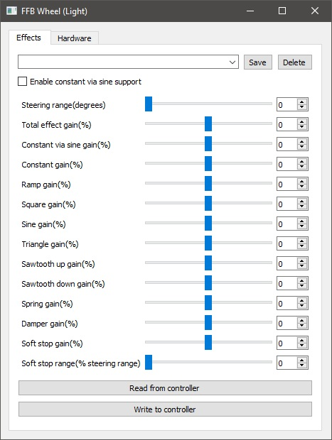

# BLDC-FFB-WHEEL

Forum link:
https://forum.simracing.su/topic/4400-dd-rul-iz-hoverborda-ya-sdelal-eto/

## Required Parts/Materials

* Odrive Board
* Hoverboard Motor
* Incremental Encoder

## Assembly

Connection diagram:

## Firmware

To program board you need [STM32CubeProgrammer](https://www.st.com/en/development-tools/stm32cubeprog.html)
* Change Odrive to DFU mode
* Connect power and USB
* In CubeProgrammer choose USB option and select USB port and connect
* Open hex file and Download it in controller
* After complete operation disconnect device by pressing disconnect button
* Disconnect power supply and change Odrive to standard mode
* Connect power supply

## Calibration and Configration

### Calibration

Before connect power supply set correct position of steering wheel, it calibrate automatically when power is on.

### GUI 

Effects

* Enable constant via sine - Enables support for effects similar to their Raceroom helmet. So far I've only met in one game. For everything except the flight room, it's better to shoot.
* Steering range - I think without question.
* Further, everything with the addition of gain is the adjustment of the strength of individual effects. Everything that is plus turns in one direction, everything that is minus turns in the other. Damper is not implemented at the moment, Total is the total effort scale that is applied to everything at once. If you need to invert all effects, just invert Total.
* Soft stop range - the distance in percentage from the Steering range at which the stop force increases at the end of the range. At the same time, the output values ​​​​of the joystick axis are already at the maximum in this range

Hardware

* Invert encoder direction - changes the encoder output direction. Does the same thing as changing the connection of pins A and B to the controller. I prefer that when turning the steering wheel clockwise, the values along axis increase.
* A / B pullup - set for encoders that need to pull up the outputs to the power supply. Most encoders are like Omron barrels, but see the instructions for the encoder if you need it or not.
* Encoder CPR - total encoder CPR, including reduction (if any) PPR * 4 * reduction ratio
* Pole pairs - the number of pairs of motor magnets. A hoverboard motor has 15 in most cases.
* FOC debug - output of paired parameters of the FOC algorithm along two axes. Useful when adjusting P Gain / I Gain parameters. Set to None for normal use. I updated the firmware so that None is the default.
* P Gain / I Gain - FOC algorithm parameters. Setting them up is a separate issue, you need to write a separate post with pictures. there Constant reading smoothing. Important parameters depend on them "noisiness" and the accuracy of the algorithm, but not easy to set up. Will be separately for them.
* Output power - total power as a percentage of the physically possible. Start low and increase a little at a time until the motor stays stable and doesn't overheat.
* Buttons - read what is written in the controller - write to the controller. Each tab has its own. Changes to the effects tab are saved separately to the hardware tab.

One of important option is to config encoder CPR.

Serial Key

The Hardware tab is inactive until the Serial Key for a specific Device ID is entered.
When the correct key is entered and the Register button is pressed, the program switches to full mode and the Enable advanced settings button becomes available on the Hardware tab. (known bug - the key is not saved between controller restarts - I'm working on it)
The Enable advanced settings button has been added so as not to accidentally change what is not necessary. For good, everything on this tab should be configured only once and forgotten.

If you want full acces to setting you need write to [propeler](https://forum.simracing.su/profile/5730-propeler/)
